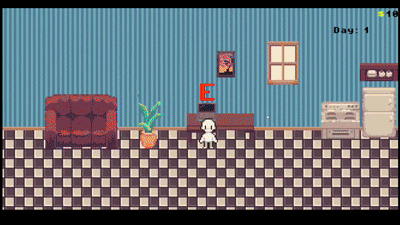
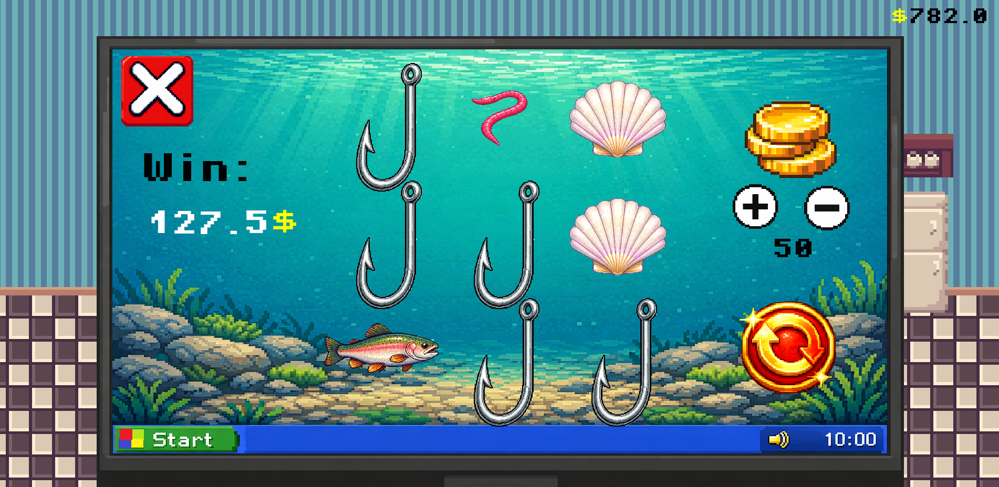

# Gamble Simulator 🎰 

*(Work in Progress)*
## Gameplay

## Slot machine

## About The Project
Gamble Simulator is a 2D management and casino simulation game developed in **Godot 4**. The core loop revolves around gathering finances, interacting with a slot machine(optional), and upgrading/purchasing items.

Besides being a passion project, I am building this game to deepen my understanding of object-oriented programming, software architecture, and event-driven systems. I also wanted to try creating UI and UI components.

## Technicals

* **Separation of Concerns:** The codebase is modulated to separate logic from visuals. For example, `game_manager.gd` manages the global game state and finances, while `shop_logic.gd` handles transactions.
* **Event-Driven UI:** Uses Godot's Signal system to communicate between the user interface and the game logic, keeping components cleanly decoupled.
* **Probability & Algorithms:** Implemented logic for the slot machine's mechanics, win rates, and random generation.
* **State Management:** Tracking the player's balance, inventory, and environment changes.

## Tech Stack
* **Game Engine:** Godot 4.x
* **Language:** GDScript
* **Version Control:** GitHub

## Future Roadmap
* Expand the shop with more unlockable items
* Implement save/load system
* Export to HTML5 for browser play
* Add events manipulating the market prices
* Add interactive minigames for all jobs (Pizza chef, Post delivery)

## Changelog / Patch Notes

**v0.2.0 - Work & UI Update**
* **New Feature:** Added "Work" mechanics with a job selection popup menu.
* **New Minigame:** Gardener minigame with plant spawning and scissors cursor. UI counting score of the player.
* **UI/UX Improvements:** Overhauled anchoring and scaling for all UI elements (Monitor, Shop, Casino, Death Screen, Work Popup) making the game responsive across different monitor resolutions and aspect ratios.
* **Architecture:** Migrated global variables (money, day, hunger) to a centralized `Global` Autoload script for better data state management.
